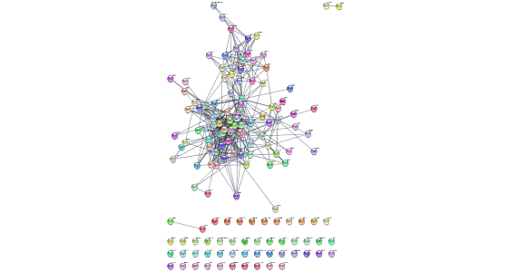
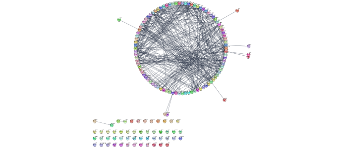
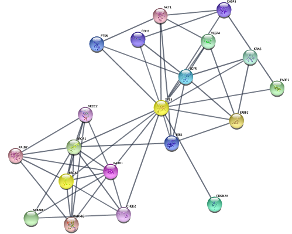
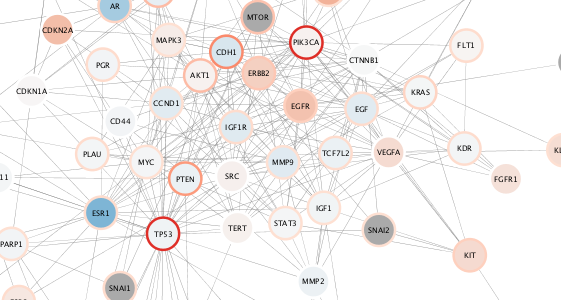

```{r, echo = FALSE}
knitr::opts_chunk$set(
  eval=FALSE
)
```
*The R markdown is available from the pulldown menu for* Code *at the upper-right, choose "Download Rmd", or [download the Rmd from GitHub](https://raw.githubusercontent.com/cytoscape/cytoscape-automation/master/for-scripters/R/notebooks/Cancer-networks-and-data.Rmd).*

<hr />
This vignette will demonstrate network retrieval from the STRING database, basic analysis, loading and visualization TCGA data in Cytoscape from R using the RCy3 package. Relevant subnetworks will be identified using different strategies, including network connectivity.

At the end of this vignette, you will have will be a visualization of TCGA data on a subnetwork built around highly mutated genes in the relevant cancer type.

<center>

</center>

<hr />

# Installation
```{r}
if(!"RCy3" %in% installed.packages()){
    install.packages("BiocManager")
    BiocManager::install("RCy3")
}
library(RCy3)
```

# Required Software
The whole point of RCy3 is to connect with Cytoscape. You will need to install and launch Cytoscape: 
    
* Download the latest Cytoscape from http://www.cytoscape.org/download.php
* Complete installation wizard
* Launch Cytoscape 

```{r}
cytoscapePing()
```

For this vignette, you'll also need the [STRING app](https://apps.cytoscape.org/apps/stringapp) to access the STRING database from within Cytoscape:

```{r}
#available in Cytoscape 3.7.0 and above
installApp('STRINGapp')  
```

# Getting Disease Networks

Use Cytoscape to query the STRING database for networks of genes associated with breast cancer and ovarian cancer.

**If the STRING app is not installed, no error is reported, but your network  will be empty**

## Query STRING database by disease to generate networks
### Breast cancer
```{r}
string.cmd = 'string disease query disease="breast cancer" cutoff=0.9 species="Homo sapiens" limit=150'
commandsRun(string.cmd)
```
Here we are using Cytoscape's command line syntax, which can be used for any core or app
automation function, and then making a GET request. Use *commandsHelp* to interrogate 
the functions and parameters available in your active Cytoscape session, including the 
apps you've installed!

{height=100%}  

### Ovarian cancer
```{r}
string.cmd = 'string disease query disease="ovarian cancer" cutoff=0.9 species="Homo sapiens" limit=150'
commandsRun(string.cmd)
```

{height=100%}

# Interacting with Cytoscape 

Now that we've got a couple networks into Cytoscape, let's see what we can do with them from R...

## Get list of networks 
```{r}
getNetworkList()
```

## Layout network
```{r}
layoutNetwork(layout.name='circular') 
```

{height=100%} 

### List of layout algorithms available
```{r}
getLayoutNames()
```

### Layout with parameters!
```{r}
getLayoutPropertyNames(layout.name='force-directed')
layoutNetwork('force-directed defaultSpringCoefficient=0.0000008 defaultSpringLength=120')
```

## Get table data from network
Now, let's look at the tablular data associated with our STRING networks...
```{r}
getTableColumnNames('node')
```

One of the great things about the STRING database is all the node and edge attriubtes they provide. Let's pull some of it into R to play with...

### Retrieve disease scores 
We can retrieve any set of columns from Cytoscape and store them as an R data frame keyed by SUID. In this case, let's retrieve the disease score column from the node table. Those will be our two parameters:
```{r}
disease.score.table <- getTableColumns('node','stringdb::disease score')
disease.score.table
```

### Plot distribution and pick threshold
Now you can use R like you normally would explore the data.
```{r}
par(mar=c(1,1,1,1))
plot(factor(row.names(disease.score.table)),disease.score.table[,1], ylab=colnames(disease.score.table)[1])
summary(disease.score.table)
```

## Generate subnetworks
In order to reflect your exploration back onto the network, let's generate subnetworks...

...from top quartile of 'disease score'
```{r}
top.quart <- quantile(disease.score.table[,1], 0.75)
top.nodes <- row.names(disease.score.table)[which(disease.score.table[,1]>top.quart)]
createSubnetwork(top.nodes,subnetwork.name ='top disease quartile')
#returns a Cytoscape network SUID
```

...of connected nodes only
```{r}
createSubnetwork(edges='all',subnetwork.name='top disease quartile connected')  #handy way to exclude unconnected nodes!
```

...from first neighbors of top 3 genes, using the network connectivity together with the data to direct discovery.
```{r}
setCurrentNetwork(network="STRING network - ovarian cancer")
top.nodes <- row.names(disease.score.table)[tail(order(disease.score.table[,1]),3)]
selectNodes(nodes=top.nodes)
selectFirstNeighbors()
createSubnetwork('selected', subnetwork.name='top disease neighbors') # selected nodes, all connecting edges (default)
```

...from diffusion algorithm starting with top 3 genes, using the network connectivity in a more subtle way than just first-degree neighbors.
```{r}
setCurrentNetwork(network="STRING network - ovarian cancer")
selectNodes(nodes=top.nodes)
diffusionBasic() # diffusion!
createSubnetwork('selected',subnetwork.name = 'top disease diffusion')
layoutNetwork('force-directed')
```

{height=100%} 

*Pro-tip*: don't forget to **setCurrentNetwork()** to the correct parent network before getting table column data and making selections.

# Visualizing data on networks

## Load datasets
Downloaded TCGA data, preprocessed as R objects. Also available via each TCGA publication, e.g.:
 
* Breast: https://tcga-data.nci.nih.gov/docs/publications/brca_2012/
* Ovarian: https://tcga-data.nci.nih.gov/docs/publications/ov_2011/
  
```{r}
load(system.file("extdata","tutorial-ovc-expr-mean-dataset.robj", package="RCy3"))
load(system.file("extdata","tutorial-ovc-mut-dataset.robj", package="RCy3"))
load(system.file("extdata","tutorial-brc-expr-mean-dataset.robj", package="RCy3"))
load(system.file("extdata","tutorial-brc-mut-dataset.robj", package="RCy3"))
```


## Breast Cancer Datset
These datasets are similar to the data frames you normally encounter in R. For diversity, one using row.names to store corresponding gene names and the other uses the first column. Both are easy to import into Cytoscape.
```{r}
str(brc.expr)  # gene names in row.names of data.frame
str(brc.mut)  # gene names in column named 'Hugo_Symbol'
```

Let's return to the Breast Cancer network...
```{r}
setCurrentNetwork(network="STRING network - breast cancer")
layoutNetwork('force-directed') #uses same settings as previously set
```

...and use the helper function from RCy3 called *loadTableData*
```{r}
?loadTableData
loadTableData(brc.expr,table.key.column = "display name")  #default data.frame key is row.names
loadTableData(brc.mut,'Hugo_Symbol',table.key.column = "display name")  #specify column name if not default
```

### Visual styles
Let's create a new style to visualize our imported data
...starting with the basics, we will specify a few defaults and obvious mappings in a custom style all our own.
```{r}
style.name = "dataStyle"
createVisualStyle(style.name)
setVisualStyle(style.name)

setNodeShapeDefault("ellipse", style.name) #remember to specify your style.name!
setNodeSizeDefault(60, style.name)
setNodeColorDefault("#AAAAAA", style.name)
setEdgeLineWidthDefault(2, style.name)
setEdgeOpacityDefault(50, style.name)
setNodeLabelMapping('display name', style.name)
```

#### Visualize expression data
Now let's update the style with a mapping for mean expression using a standard Color Brewer palette.

```{r}
setNodeColorMapping('expr.mean', colors=paletteColorBrewerRdBu, style.name=style.name)
```
<center>
{height=100%} 
</center>


### Visualize mutation data
OK, now let's update with a mapping for mutation. Here are all the same steps, but this time mapping mutation counts to *both* node border width and color. 
```{r}
setNodeBorderColorMapping('mut_count', colors = paletteColorBrewerReds, style.name=style.name)
setNodeBorderWidthMapping('mut_count', widths = c(2,8), style.name=style.name) # min and max width values are arbitrarily provided here
```
This is a useful pair of visual properties to map to a single data column. See why?

{height=100%} 

### Subnetwork based on diffusion from heavily mutated nodes
Now, let's pull in what we learned about subnetwork selection and apply it here...
```{r}
top.mut <- (brc.mut$Hugo_Symbol)[tail(order(brc.mut$mut_count),2)]
top.mut
selectNodes(nodes=top.mut,'display name')
diffusionBasic() 
createSubnetwork('selected',subnetwork.name = 'top mutated diffusion')
layoutNetwork('force-directed defaultSpringCoefficient=0.000008 defaultSpringLength=60')
```

The top mutated genes are based on TCGA data and the diffusion algorithm is operating based on the network connectivity from STRING data, leading to a focused subnetwork view of critical Breast Cancer genes with mean patient expression data mapped to fill color. Now *that's* data integration!

{height=100%} 

**Pro-tip: You can generate a legend for this in Cytoscape Style tab > Options > Create style...  This is no yet available as a command.**

## Ovarian Cancer Datset
But what about the other network and datasets? Do we have to repeat *all* of those steps again?  Actually, no!

First, let's switch back over to the Ovarian Cancer network and load our data.
```{r}
setCurrentNetwork(network="STRING network - ovarian cancer")
clearSelection()
str(ovc.expr)  # gene names in row.names of data.frame
str(ovc.mut)  # gene names in column named 'Hugo_Symbol'

loadTableData(ovc.expr, table.key.column = 'display name')
loadTableData(ovc.mut,'Hugo_Symbol', table.key.column = 'display name')
```

**Because we used the same column names in our original data frames, now we can simply apply the *same* visual style created above!**
```{r}
setVisualStyle(style.name=style.name)
```

{height=100%}  

Reusing the same style for both breast and ovarian cancers, we can compare the relative expression and mutation counts across the two datasets. 
For example, notice in the case of ovarian cancer: **decreased** range of mean expression and **fewer** mega-mutated genes.

# Saving, sharing and publishing

## Saving a Cytoscape session file
Session files save *everything*. As with most project software, we recommend saving often!
```{r}
saveSession('tutorial_session') #.cys
```
**Note:** If you don't specify a complete path, the files will be saved relative to your current working directory in R. 

## Saving high resolution image files
You can export extremely high resolution images, including vector graphic formats.
```{r}
exportImage(filename='tutorial_image2', type = 'PDF') #.pdf
?exportImage
```

