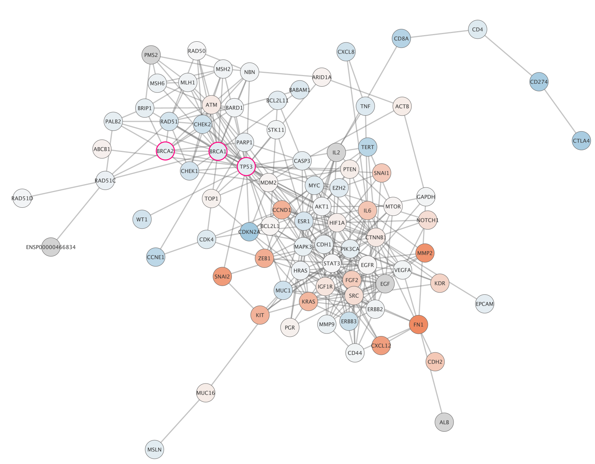
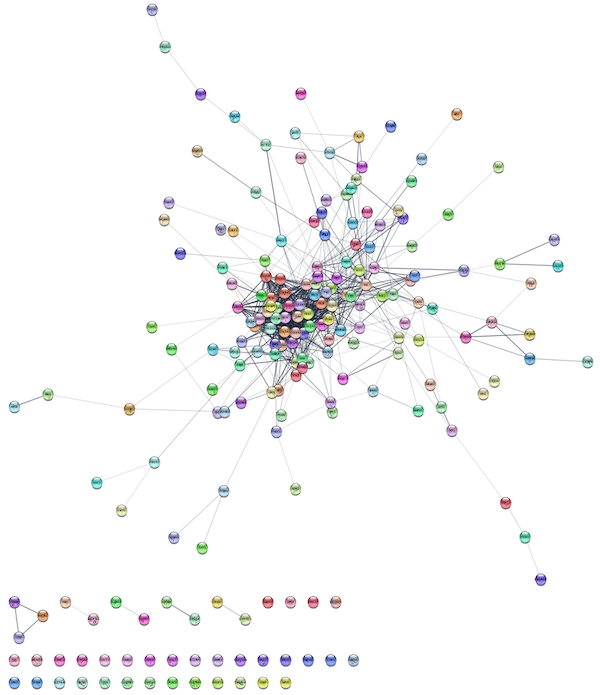
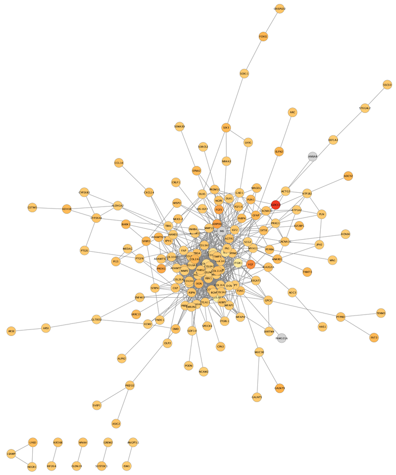
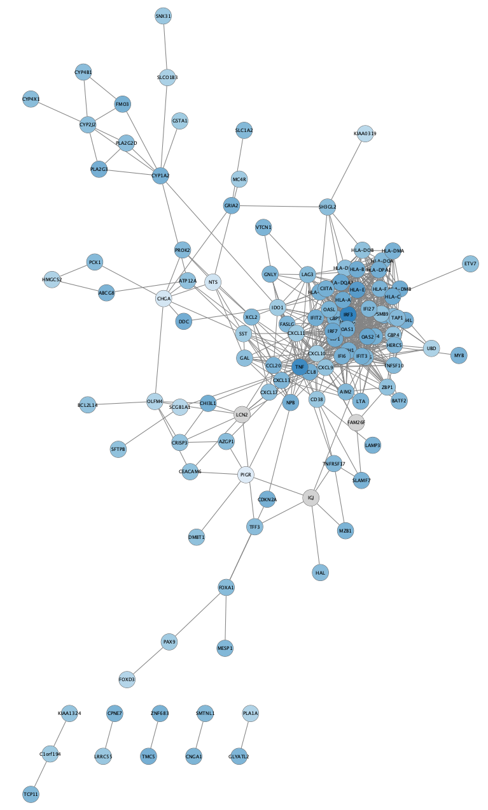

```{r, echo = FALSE}
knitr::opts_chunk$set(
  eval=FALSE
)
```

*The R markdown is available from the pulldown menu for* Code *at the upper-right, choose "Download Rmd", or [download the Rmd from GitHub](https://raw.githubusercontent.com/cytoscape/cytoscape-automation/master/for-scripters/R/notebooks/Differentially-expressed-genes.Rmd).*

<hr />

This protocol describes a network analysis workflow in Cytoscape for a set of differentially expressed genes. Points covered:

- Retrieving relevant networks from public databases
- Network functional enrichment analysis
- Integration and visualization of experimental data
- Exporting network visualizations

<center>

</center>

<hr />

# Installation
```{r, eval = FALSE}
if (!requireNamespace("BiocManager", quietly = TRUE)){
  install.packages("BiocManager")
}

if(!"RCy3" %in% installed.packages()){
  BiocManager::install("RCy3")
}
library(RCy3)
```

# Getting started
First, launch Cytoscape and keep it running whenever using RCy3. Confirm that you have everything installed and running:
```{r}
cytoscapePing()
cytoscapeVersionInfo()
```

# Prerequisites

If you haven't already, install the [STRINGapp](http://apps.cytoscape.org/apps/stringapp)

```{r}
installApp('stringApp')
```

# Background

Ovarian serous cystadenocarcinoma is a type of epithelial ovarian cancer which accounts for ~90% of all ovarian cancers.
The data used in this protocol are from [The Cancer Genome Atlas](https://cancergenome.nih.gov/), in which multiple subtypes of serous cystadenocarcinoma were identified and characterized by mRNA expression.

We will focus on the differential gene expression between two subtypes, **Mesenchymal** and **Immunoreactive**.

For convenience, the data has already been analyzed and pre-filtered, using log fold change value and adjusted p-value.

# Network Retrieval

Many public databases and multiple Cytoscape apps allow you to retrieve a network or pathway relevant to your data.
For this workflow, we will use the STRING app. Some other options include:

- [WikiPathways](https://nrnb.org/gsod2019_kozo_nishida/html_documents/Rmd/wikipathways-app.html)
- [NDEx](http://www.ndexbio.org/)
- [GeneMANIA](https://genemania.org/)

# Retrieve Networks from STRING

To identify a relevant network, we will query the STRING database in two different ways:

- Query **STRING protein** with the list of differentially expressed genes.
- Query **STRING disease** for a keyword; **ovarian cancer**.

The two examples are split into two separate workflows below.

# Example 1: STRING Protein Query Up-regulated Genes

Load the file containing the differential gene expression data and filter for up-regulated genes, TCGA-Ovarian-MesenvsImmuno_data.csv:

```{r}
de.genes <- read.table("https://raw.githubusercontent.com/cytoscape/cytoscape-tutorials/gh-pages/protocols/data/TCGA-Ovarian-MesenvsImmuno_data.csv", header = TRUE, sep = ",", quote="\"", stringsAsFactors = FALSE)
de.genes.up <- de.genes[which(de.genes$logFC >= 1.8 & de.genes$FDR.adjusted.Pvalue <= 0.05),]
```

We will use the identifiers in the first column of this datafile to run a **STRING protein query**, with confidence (score) cutoff of 0.4 and no additional proteins (limit = 0):

```{r}
string.cmd = paste('string protein query query="', paste(de.genes.up$Gene, collapse = '\n'), '" cutoff=0.4 limit=0 species="Homo sapiens"', sep = "")
commandsRun(string.cmd)
```

The resulting network will load automatically and contains up-regulated genes recognized by STRING, and interactions between them with an evidence score of 0.4 or greater.

<center>

</center>

The networks consists of one large connected component, several smaller networks, and some unconnected nodes. We will you a handy utility app for Cytoscape to select the largest connected component and create a subnetwork with it.

```{r}
installApp("Largest Subnetwork")
commandsRun("network select subnetwork createSubnetwork=true")
```

# Data Integration

Next we will create a visualization from the log fold changes and p-values from our TCGA dataset. Our data from TCGA has NCBI Gene identifiers, and our STRING network retained these identifiers in the "query term" column.

```{r}
loadTableData(de.genes, data.key.column="Gene", table.key.column="query term")
```

You will notice two new columns (logFC and FDR.adjusted.Pvalue) in the Node Table. 

```{r}
tail(getTableColumnNames('node'))
```

# Visualization
Next, we will create a visualization of the imported data on the network. Let's set all the defaults first:

```{r}
copyVisualStyle(from.style = "default", to.style = "de genes up")
setVisualStyle("de genes up")
setNodeShapeDefault("ELLIPSE", "de genes up")
lockNodeDimensions("TRUE", "de genes up")
setNodeSizeDefault("50", "de genes up")
setNodeColorDefault("#D3D3D3", "de genes up")
setNodeBorderWidthDefault("2", "de genes up")
setNodeBorderColorDefault("#616060", "de genes up")
setNodeLabelMapping("display name", "de genes up")
setNodeFontSizeDefault("14", "de genes up")
setEdgeOpacityDefault(100, "de genes up")
```

Then we can use the **logFC** values to produce a gradient of node fill colors:

```{r}
setNodeColorMapping('logFC', colors=paletteColorBrewerYlOrRd, style.name="de genes up")
```

*Note: we are using `paletteColorBrewerYlOrRd` to generate a set of standardized colors balanced for a sequential gradient (low to high), which are automatically matched to the `logFC` column values.*

Applying a force-directed layout, the network will now look something like this:

```{r}
layoutNetwork(paste('force-directed', 
              'defaultSpringCoefficient=0.000009',
              'defaultSpringLength=50',
              'defaultNodeMass=4',
              sep=' '))
```

<center>

</center>

# Enrichment Analysis Options

Next, we are going to perform enrichment analysis uing the STRING app.

## STRING Enrichment

The STRING app has built-in enrichment analysis functionality, which includes enrichment for GO Process, GO Component, GO Function, InterPro, KEGG Pathways, and PFAM.

First, we will run the enrichment on the whole network, against the genome: 

```{r}
commandsRun('string retrieve enrichment allNetSpecies="Homo sapiens"')
commandsRun('string show enrichment')
```

When the enrichment analysis is complete, a new tab titled **STRING Enrichment** will open in the **Table Panel**.

<center>

</center>

The STRING app includes several options for filtering and displaying the enrichment results.
The features are all available at the top of the **STRING Enrichment** tab.

We are going to filter the table to only show GO Process:

```{r}
commandsRun('string filter enrichment categories="GO Biological Process", overlapCutoff = "0.5", removeOverlapping = "true"')
```

Next, we will add a split donut chart to the nodes representing the top terms:

```{r}
commandsRun('string show charts')
```

## STRING Protein Query: Down-regulated genes

We are going to repeat the network search, data integration, visualization and enrichment analysis for the set of down-regulated genes by subsetting our original dataset for downregulated logFC genes:

```{r}
de.genes.down <- de.genes[which(de.genes$logFC <= -1.1 & de.genes$FDR.adjusted.Pvalue <= 0.05),]
string.cmd = paste('string protein query query="', paste(de.genes.down$Gene, collapse = '\n'), '" cutoff=0.4 limit=0 species="Homo sapiens"', sep = "")
commandsRun(string.cmd)
```

## Subnetwork

Let's select only the connected nodes to work with for the rest of this tutorial, by creating a subnetwork based on all edges:

```{r}
commandsRun("network select subnetwork createSubnetwork=true")
```

## Data integration

Again, we can import the data, mapping to the "query term" column:

```{r}
loadTableData(de.genes,data.key.column="Gene",table.key.column="query term")
```

## Visualization
Next, we can create a visualization. Note that we can reuse most of the previous style (e.g., all the default settings) and just provide a new node color mapping with downregulated color scheme, like `paletteColorBrewerBlues`:

```{r}
copyVisualStyle(from.style = "de genes up", to.style = "de genes down")
setVisualStyle(style.name="de genes down")

setNodeColorMapping('logFC', colors=paletteColorBrewerBlues, style.name="de genes down")
```

Apply a force-directed layout.

```{r}
layoutNetwork(paste('force-directed', 
              'defaultSpringCoefficient=0.00001',
              'defaultSpringLength=50',
              'defaultNodeMass=4',
              sep=' '))
```

Focusing on the connected part of the network, it should look something like this:
<center>


## STRING Enrichment

Now we can perform STRING Enrichment analysis on the resulting network:

```{r}
commandsRun('string retrieve enrichment allNetSpecies="Homo sapiens"')
commandsRun('string show enrichment')
```

Filter the analysis results for non-redundant GO Process terms only. 

```{r}
commandsRun('string filter enrichment categories="GO Biological Process", overlapCutoff = "0.5", removeOverlapping = "true"')
```

```{r}
commandsRun('string show charts')
```

## STRING Disease Query

So far, we queried the STRING database with a set of genes we knew were differentially expressed. Next, we will query the **STRING disease** database to retrieve a network genes associated with ovarian cancer, which will be completely independent of our dataset.

```{r}
commandsRun('string disease query disease="ovarian cancer" cutoff="0.95"')
```

This will bring in the top 100 (default) ovarian cancer associated genes connected with a confidence score greater than 0.95. Again, lets extract out the connected nodes:

```{r}
commandsRun("network select subnetwork createSubnetwork=true")
```

# Data integration

Next we will load the same differential gene expression data from our TCGA dataset to create a visualization. This time we will need to do some identifier mapping to match the data to the network.

```{r}
mapped.cols <- mapTableColumn("display name",'Human','HGNC','Entrez Gene')
```

Here we set **Human** as species, **HGNC** as **Map from**, and **Entrez Gene** as **To**.

We can now import the data frame with the data into the node table in Cytoscape:

```{r}
loadTableData(de.genes, data.key.column = "Gene", table = "node", table.key.column = "Entrez Gene")
```

# Visualization

Again, we can create a visualization reusing our prior style and setting a new color gradient for the nodes:

```{r}
copyVisualStyle(from.style = "de genes up", to.style = "ovarian")
setVisualStyle(style.name="ovarian")

setNodeColorMapping('logFC', colors=paletteColorBrewerRdBu, style.name="ovarian")
```
Apply a force-directed layout.

```{r}
layoutNetwork(paste('force-directed', 
              'defaultSpringCoefficient=0.000006',
              'defaultSpringLength=50',
              'defaultNodeMass=2',
              sep=' '))
``` 

The TCGA found several genes that were commonly mutated in ovarian cancer, so called "cancer drivers".
We can add information about these genes to the network visualization, by changing the visual style of these nodes.
Three of the most important drivers are **TP53**, **BRCA1** and **BRCA2**.
We will add a thicker, colored border for these genes in the network.

Select all three driver genes by:

```{r}
selectNodes(c("TP53", "BRCA1", "BRCA2"), by.col = "display name")
```

Add a style bypass for node **Border Width** (5) and node **Border Paint** (bright pink):

```{r}
setNodeBorderWidthBypass(getSelectedNodes(), 5)
setNodeBorderColorBypass(getSelectedNodes(), '#FF007F')
```

<center>
 
</center>

# Exporting Networks
Cytoscape provides a number of ways to export results and visualizations:

- As an image:

```{r}
exportImage('differentially-expressed-genes', 'PDF')
```

*Note: PNG, SVG, JPEG and PS are also supported*

- To a public repository:

```
exportNetworkToNDEx("user", "password", TRUE) #requires a free NDEx account
```