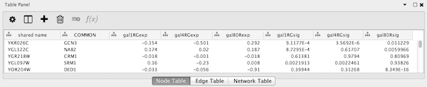

```{r, echo = FALSE}
knitr::opts_chunk$set(
  eval=FALSE
)
```
*The R markdown is available from the pulldown menu for* Code *at the upper-right, choose "Download Rmd", or [download the Rmd from GitHub](https://raw.githubusercontent.com/cytoscape/cytoscape-automation/master/for-scripters/R/notebooks/basic-data-visualization.Rmd).*

<hr />

Cytoscape is an open source software platform for integrating, visualizing, and analyzing measurement data in the context of networks. This tutorial presents a scenario of how expression and network data can be combined to tell a biological story and includes these concepts:

 - Visualizing networks using expression data.
 - Filtering networks based on expression data.
 - Assessing expression data in the context of a biological network.


<hr />

# Installation
```{r, eval = FALSE}
if (!requireNamespace("BiocManager", quietly = TRUE))
  install.packages("BiocManager")

if(!"RCy3" %in% installed.packages())
  BiocManager::install("RCy3")

library(RCy3)
```

# Getting started
First, launch Cytoscape and keep it running whenever using RCy3. Confirm that you have everything installed and running:
```{r}
cytoscapePing()
cytoscapeVersionInfo()
```

# Loading Network
Let's open a Cytoscape demo session file: 

```{r}
openSession()
```

# Visualizing Expression Data on Networks

Probably the most common use of expression data in Cytoscape is to set the **visual style** of the nodes (color, shape, border) in a network according to available data. This creates a powerful visualization, portraying functional relation and experimental response at the same time. Here, we will show an example of doing this.

The data used in this example is from yeast, and represents an experiment of perturbations of the genes **Gal1**, **Gal4**, and **Gal80**, which are all yeast transcription factors.

For this tutorial, the experimental data was part of the Cytoscape session file you loaded earlier, and is visible in the Node Table:

<center>

</center>

We can now use the data to manipulate the visual properties of the network by mapping specific data columns to visual style properties:

The **gal80Rexp** expression values will be mapped to node color; nodes with low expression will be colored blue, nodes with high expression will be colored red.
Significance for expression values will be mapped to Node Border Width, so nodes with significant changes will appear with a thicker border.

## Set Node Fill Color

Let's specify the node fill color as a gradient ranging from **blue to red** for expression values using a continuous mapping for the 'gal80Rexp' column:

```{r}
setNodeColorMapping('gal80Rexp', colors=paletteColorBrewerRdBu, style.name="galFiltered Style")
```

*Note: we are using `paletteColorBrewerRdBu` to generate a set of three standardized colors balanced for a divergent gradient (low, mid, high), which are automatically extracted from the `gal80RExp` column.*


This produces an initial gradient ranging from blue to red for expression values. Notice that the nodes in the network change color.


<center>

</center>

## Set Node Border Color and Width

To visualize the significance of measurements, let's add a contiuous mapping for 'gal80Rsig' p-values to Node Border Color:
```{r}
setNodeBorderColorMapping('gal80Rsig',c(0,0.05), c("#FF0000","#FF0000","#FF0000","#555555"),style.name="galFiltered Style")
```

*Note: We are supplying a min and max points, together with *four *color values. Providing n+2 values will result in assigning "below min" and "above max" mappings (see image).*

<center>

</center>
...and let's also map the same gal80RSig values to set the Node Border Widths:

```{r}
setNodeBorderWidthMapping('gal80Rsig',c(0,0.05),c(4,4),style.name="galFiltered Style")
```

*Note: We are supplying the same min and max points, together with just two width values. Providing n values will result in 1:1 assignments.*

<center>

</center>


# Select Nodes

Cytoscape allows you to easily filter and select nodes and edges based on data attributes. Next, we will select a subset of nodes with high expression in the gal80 knockout:

Let's select a subset of nodes with high expression in the gal80 knockout: 


```{r}
createColumnFilter('myFilter', 'gal80Rexp', 2, "GREATER_THAN")
```

You should now see only three nodes in the network selected (highlighted yellow).

## Expand Selection 

We have now selected only the few top expressing nodes. To see the context of these nodes in the larger network, we can expand the selection to second-degree neighbors:

```{r}
selectFirstNeighbors() # first degree
selectFirstNeighbors() # second degree
```

## Create New Network
Finally, we can create a subnetwork from this selection and apply a layout algorithm:

```{r}
createSubnetwork(nodes="selected", subnetwork.name='galFiltered sub')
layoutNetwork('force-directed')
```

*Note: Cytoscape supports many different layout algorithms, described in detail in the [Cytoscape manual](http://manual.cytoscape.org/en/stable/Navigation_and_Layout.html?highlight=layout#automatic-layout-algorithms).*

<center>

</center>

Digging into the biology of this network, it turns out that GAL4 is repressed by GAL80. Both nodes (GAL4 and GAL11) show fairly small changes in expression, and neither change is statistically significant: they are pale blue with thin borders. These slight changes in expression suggest that the critical change affecting the red nodes might be somewhere else in the network, and not either of these nodes. GAL4 interacts with GAL80, which shows a significant level of repression: it is medium blue with a thicker border.

Note that while GAL80 shows evidence of significant repression (blue), most nodes interacting with GAL4 show significant levels of induction (red). GAL11 is a general transcription co-factor with many interactions.

Putting all of this together, we see that the ***transcriptional activation activity of Gal4 is repressed by Gal80***. So, repression of Gal80 increases the transcriptional activation activity of Gal4. Even though the expression of Gal4 itself did not significantly change (no red border), ***the Gal4 transcripts were much more likely to be active transcription factors when Gal80 was repressed***. This explains why there is so much up-regulation in the vicinity of Gal4.

# Summary

In summary, we have:

- Explored a yeast interactome from a transcription factor knockout experiment
- Created a visual style using expression value as node color and with border width mapped to significance
- Selected high expressing genes and their neighbors and created a new network

Finally, we can now export this network as a publication-quality image....

# Saving Results

Cytoscape provides a number of ways to save results and visualizations:

- As a session:

```{r}
saveSession('./basic-data-visualization.cys')
```

- As an image:

```{r}
exportImage('./basic-data-visualization', 'PDF')
```

*Note: PNG, SVG, JPEG and PS are also supported*

- To a public repository:

```
exportNetworkToNDEx("user", "pass", TRUE) #requires a free NDEx account
```

- As a graph format file (Formats: "CX JSON", "Cytoscape.js JSON", "GraphML", "XGMML", "SIF",...):

```{r}
exportNetwork('./basic-data-visualization', 'CX')
```

*Note: cyjs, graphML, xGMML and SIF are also supported*