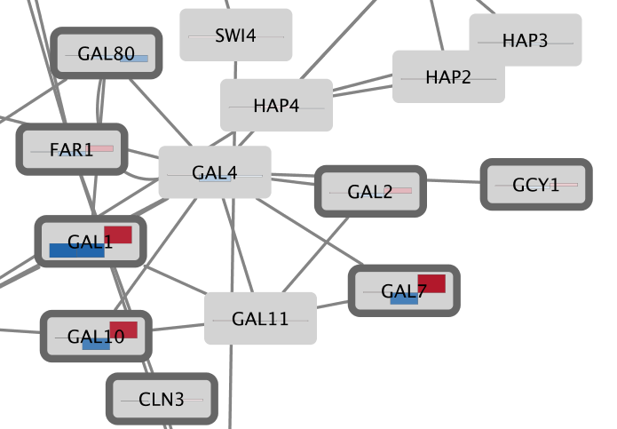

```{r, echo = FALSE}
knitr::opts_chunk$set(
  eval=FALSE
)
```

*The R markdown is available from the pulldown menu for* Code *at the upper-right, choose "Download Rmd", or [download the Rmd from GitHub](https://raw.githubusercontent.com/cytoscape/cytoscape-automation/master/for-scripters/R/notebooks/mapping-data.Rmd).*

<hr />

Probably the most common use of expression data in Cytoscape is to set the visual attributes of the nodes in a network according to expression data. This creates a powerful visualization, portraying functional relation and experimental response at the same time. Here, we will walk through the steps for doing this.

<center>

</center>

<hr />

# Installation
```{r, eval = FALSE}
if (!requireNamespace("BiocManager", quietly = TRUE))
  install.packages("BiocManager")
if(!"RCy3" %in% installed.packages())
  BiocManager::install("RCy3")

install.packages("httr")
```

# Getting started
First, launch Cytoscape and keep it running whenever using RCy3. Confirm that you have everything installed and running:
```{r}
library(RCy3)
cytoscapePing()
cytoscapeVersionInfo()
```

# Loading Network

- The demo session is available [here](http://nrnb.org/data/galFilteredSimpleData.cys) and can be opened using:

```{r}
library(httr)
cys_url = "http://nrnb.org/data/galFilteredSimpleData.cys"
GET(cys_url, write_disk(tf <- tempfile(fileext = ".cys")))
openSession(tf)
```

- When the network first opens, the entire network is not visible because of the default zoom factor used. To see the whole network, we can use the `fitContent ` function:

```{r}
fitContent()
```

# Label the Nodes

- Zoom in on the network so that node labels are visible.
- Check available column names.

```{r}
getTableColumnNames('node')
```

- We are going to use the COMMON name attribute to give the nodes useful names:

```{r}
setNodeLabelMapping('COMMON')
```

- Verify that the node labels on the network have changed to their common names.

# Color the nodes

- As we saw from the "getTableColumnNames" command, there is a column named **gal80Rexp**, which contains expression data. Let's check the expression value range of the data in this column:

```{r}
gal80rexp.score.table <- getTableColumns('node', "gal80Rexp")
gal80rexp.min <- min(gal80rexp.score.table, na.rm = T)
gal80rexp.max <- max(gal80rexp.score.table, na.rm = T)
print(gal80rexp.min)
print(gal80rexp.max)
```

- The following produces a default gradient ranging from blue to red for **gal80Rexp** expression values. Notice that the nodes in the network change color.

```{r}
setNodeColorMapping("gal80Rexp", c(-gal80rexp.max, 0, gal80rexp.max), c('#0000FF', '#FFFFFF', '#FF0000'))
```

- The network should now look like this:


# Set the Default Node Color

Note that the default node color of pale blue is close to the color range in the created palette.
A useful trick is to choose a color outside this spectrum to distinguish nodes with no defined expression value and those with slight repression.

- Here we choose a dark gray color for default node color:

```{r}
setNodeColorDefault('#A9A9A9')
```

- Zoom out on the network view to verify that a few nodes have been colored gray:

```{r}
fitContent()
```

# Set the Node Border

We imported both expression measurement values and corresponding significance values. 
We can use the significance values to change the border of nodes to highlight measurements we have confidence in.

Let's create a thicker node border for nodes with **gal80Rsig** value less than 0.05.
First, we need to get the min and max of values for **gal80Rsig**

```{r}
gal80rsig.score.table <- getTableColumns('node', "gal80Rsig")
gal80rsig.min <- min(gal80rsig.score.table, na.rm = T)
gal80rsig.max <- max(gal80rsig.score.table, na.rm = T)
print(gal80rsig.min)
print(gal80rsig.max)
```

```{r}
setNodeBorderWidthMapping('gal80Rsig', c(gal80rsig.min, "0.0499999", "0.05", gal80rsig.max), c('10',"10",'0', '0'))
```

The node border now indicates significance, but since the default node border color is a pale grey, it is not very visible. We can change the default border color to a darker grey:

```{r}
setNodeBorderColorDefault('#666666')
```

# Fun with Charts

In addition to coloring the nodes, Cytoscape also provides the ability to draw charts and graphs on each node.
For example, suppose we wanted to display a bar chart showing all of the expression values on each of our nodes?

- To reset things a little, remove the mapping for Fill Color. First, let's find out the property name for Fill Color:

```{r}
getVisualPropertyNames()
```

```{r}
deleteStyleMapping("default", "NODE_FILL_COLOR")
```

- Now change the default value to a lighter shade of grey so we can see our chart:

```{r}
setNodeColorDefault('#D3D3D3')
```

- The following indicates that we're going to use the data from these three columns expression data (gal1RGexp, gal4RGexp, gal80Rexp) to create bar chart.

```{r}
setNodeCustomBarChart(c("gal1RGexp", "gal4RGexp", "gal80Rexp"), "HEAT_STRIPS")
```

The network now shows heat strips for the three expression values, with colors chosen from a default Brewer palette. 


