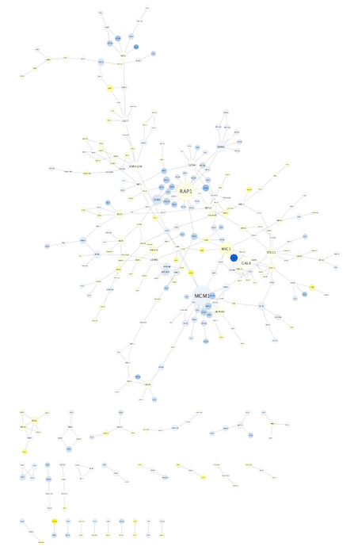
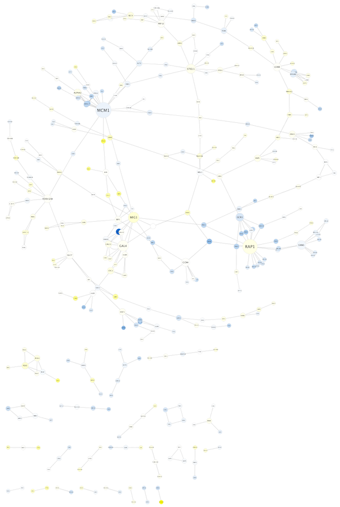
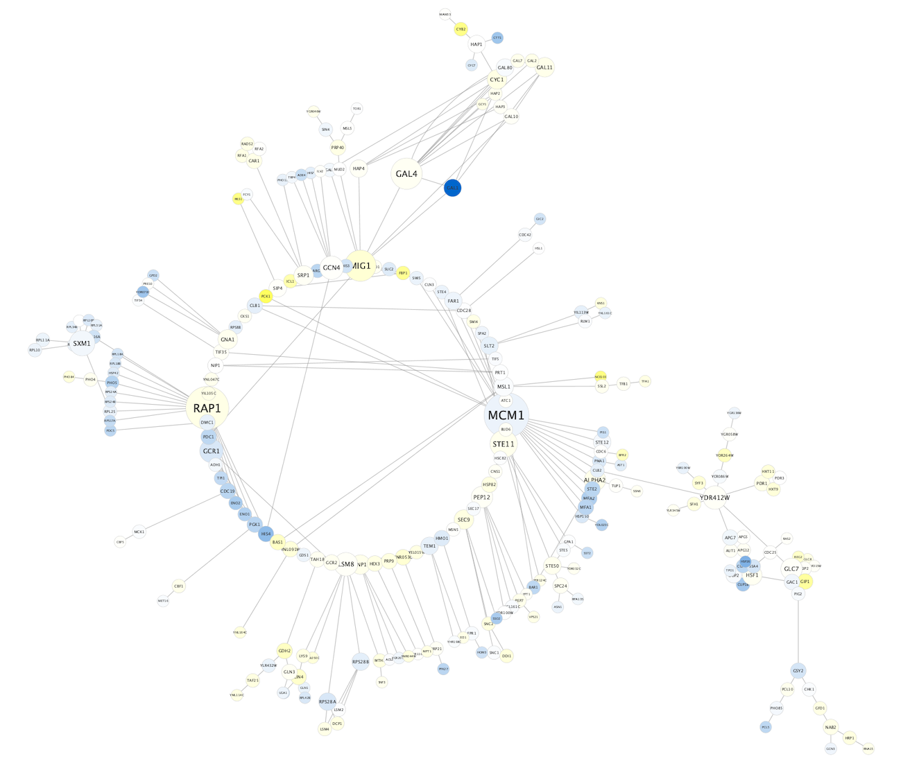
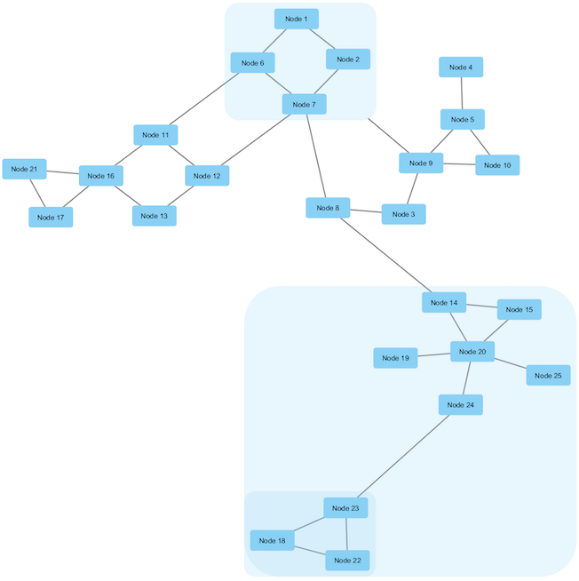

```{r, echo = FALSE}
knitr::opts_chunk$set(
  eval=FALSE
)
```

*The R markdown is available from the pulldown menu for* Code *at the upper-right, choose "Download Rmd", or [download the Rmd from GitHub](https://raw.githubusercontent.com/cytoscape/cytoscape-automation/master/for-scripters/R/notebooks/network-layout.Rmd).*
<hr />

Cytoscape includes many automatic layout algorithms, for organizing the network visually. All available layout algorithms are listed in the **Layout** menu, including any layout aglorithms loaded by apps. This tutorial will describe how to apply a layout to your network, give a few examples of commonly used layout algorithms, and describe how layout algorithm parameters can be adjusted.

<hr />

# Installation
```{r, eval = FALSE}
if (!requireNamespace("BiocManager", quietly = TRUE))
  install.packages("BiocManager")

if(!"RCy3" %in% installed.packages())
  BiocManager::install("RCy3")

library(RCy3)
```

# Getting started
First, launch Cytoscape and keep it running whenever using RCy3. Confirm that you have everything installed and running:
```{r}
cytoscapePing()
cytoscapeVersionInfo()
```

# Applying a Layout Algorithm

Load the [galFiltered.cys](https://cytoscape.github.io/cytoscape-tutorials/protocols/data/galFiltered.sys) session file.

```{r}
openSession()
```

Use "fitContent" to see the whole network:

```{r}
fitContent()
```
<center>
</center>

The network layout used in this session file is the **Prefuse Force Directed Layout**. This layout is based on the algorithm implemented as part of the [prefuse toolkit](http://www.prefuse.org/).
The algorithm is very fast and with the right parameters can provide a very visually pleasing layout. The Force Directed Layout can also use a numeric edge attribute as a weight for the length of the spring.

# Layout Menu

Available layouts can be found from:

```{r}
getLayoutNames()
```

Note that some Cytoscape apps may add additional layout algorithms to the Layout menu so the listing of available layouts may be influenced by which apps you have loaded.

In addition to the built-in layout algorithms available by default, a set of yFiles layouts are available for installation.
(But yFiles does not support Cytoscape Automation and cannot be controlled from RCy3.)

```{r}
installApp('yFiles Layout Algorithms')
```

These require a license agreement.

# Examples of Layout Algorithms

Similarly to Prefuse Force Directed, the **Edge-weighted spring-embedded** layout is also based on a “force-directed” paradigm as implemented by Kamada and Kawai (1988).
Network nodes are treated like physical objects that repel each other, such as electrons. The connections between nodes are treated like metal springs attached to the pair of nodes. These springs repel or attract their end points according to a force function. The layout algorithm sets the positions of the nodes in a way that minimizes the sum of forces in the network.

```{r}
layoutNetwork('kamada-kawai')
```
<center>
</center>

The **circular** algorithm produces layouts that emphasize group and tree structures within a network.
It partitions the network by analyzing its connectivity structure, and arranges the partitions as separate circles.
The circles themselves are arranged in a radial tree layout fashion.

```{r}
layoutNetwork('circular')
```

<center>
</center>

The **Compound Spring Embedder (CoSE) layout** is based on the traditional force-directed layout algorithm with extensions to handle multi-level nesting (compound nodes), edges between nodes of arbitrary nesting levels and varying node sizes.
It is the suggested Cytoscape layout for compound graphs, although it also works very well with noncompound graphs.

```{r}
layoutNetwork('cose')
```
<center>
</center>

# Layout Settings

To change the settings for a particular algorithm, first you need to check the relevant set of parameters. The following code chunk will display the parameter names.

```{r}
getLayoutPropertyNames('cose')
```

To change the settings for a particular algorithm:

```{r}
setLayoutProperties('cose', list(incremental='false', idealEdgeLength=50, springStrength=50, repulsionStrength=50, gravityStrength=50, compoundGravityStrength=50, gravityRange=50, compoundGravityRange=50, smartEdgeLengthCalc='true', smartRepulsionRangeCalc='true'))
```